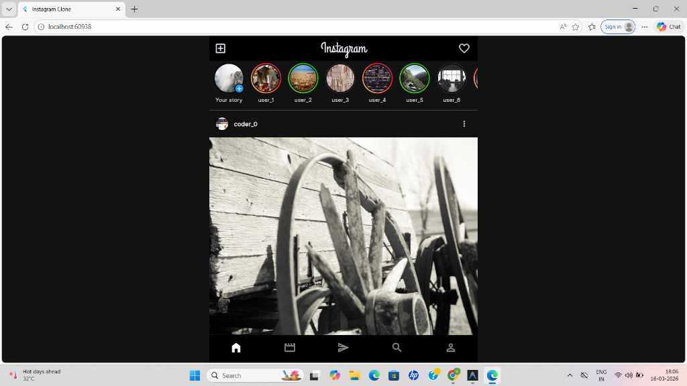
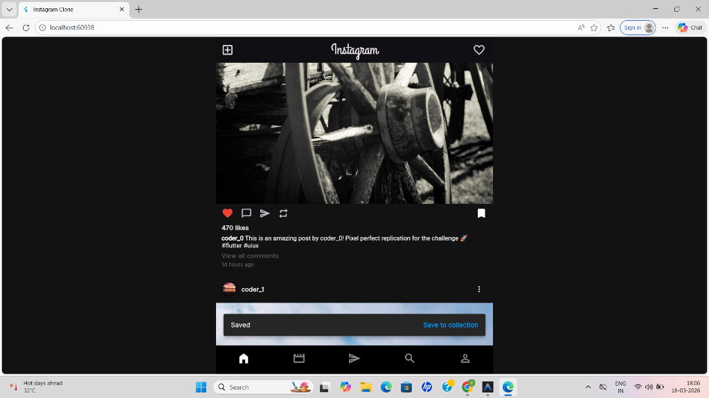
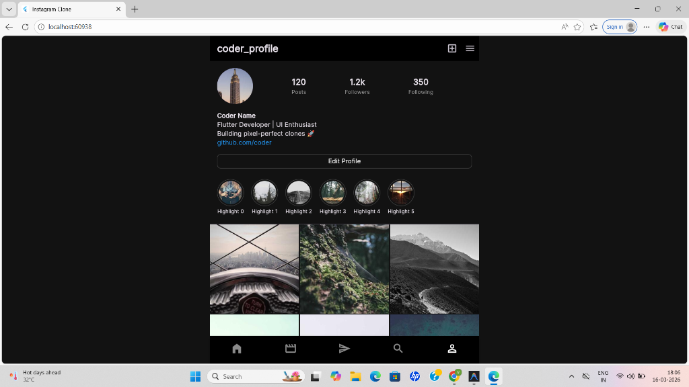

# Instagram "Pixel-Perfect" Feed - Flutter UI/UX Challenge

This repository contains a high-fidelity, "Pixel-Perfect" replication of the Instagram Home Feed, built to demonstrate high attention to detail, clean architectural patterns, and advanced gesture handling.

## 📸 Gallery

| Home Feed | Saved Notification | Profile Screen |
| :---: | :---: | :---: |
|  |  |  |

## 🚀 Key Features & Implementation

### 📱 The "Mirror Test" (UI Fidelity)
- **Top Bar**: Navigation layout matching the current Instagram Home Feed with the **Add (+)** button leading, **Centered Instagram Logo**, and **Notifications (Heart)** on the right.
- **Story Tray**: Fully implemented story states including **Unseen** (Branded Gradient), **Seen** (Muted Grey), and **Close Friends** (Green Gradient).
- **Centered Desktop Layout**: Optimized for all screen sizes with a **600px Max-Width** constraint and `#121212` background for an optimized browser experience.
- **Typography & Icons**: Curated fonts via `Google Fonts` (Grand Hotel & Inter) and precise icon scaling to match the real-world app.

### 🔍 Advanced Media & Interaction
- **Pinch-to-Zoom Overlay**: High-fidelity implementation using a lifting `Overlay` system. Includes a **2-finger threshold** to prevent accidental triggers while scrolling and smooth elastic snap-back physics.
- **Carousel Posts**: Optimized horizontal scrolling with synchronized **White Dot Indicators** and a `(1/N)` counter overlay.
- **Double-Tap to Like**: Integrated custom elastic heart animation overlay on images with haptic feedback.
- **Stateful Interaction**: Like and Save buttons toggle state instantly with local feedback (Haptics: Medium for Like, Light for Save).
- **Saved Notification**: A standard Instagram-style floating bar with a "Save to collection" action button appears instantly upon bookmarking.

### 🏗️ Technical Architecture
- **State Management**: Implemented using **Provider**. 
  - *Why Provider?* It offers a clean, performant way to handle `ChangeNotifier` updates without the boilerplate of Bloc, while ensuring a strict separation between UI and business logic.
- **PostRepository & Mock Data**: A dedicated repository layer provides data via `Future`.
  - **Latency Simulation**: A hardcoded **1.5-second delay** is applied to simulate real-world API fetching.
  - **Loading State**: Customized **Shimmer Effects** are used for both the Story Tray and the Post Feed for a native user experience during data fetching.
- **Infinite Scroll (Pagination)**: Implemented a lazy-loading trigger that fetches a new batch of 10 posts when the user is within **2 posts** of the bottom.
- **Clean Code**: Strict directory structure:
  - `models/`: Immutable data structures.
  - `repositories/`: Data sourcing and simulated network logic.
  - `providers/`: State management and business logic.
  - `widgets/`: Modular, reusable UI components.
  - `screens/`: Main page layouts.

### 🛠️ Performance & Resilience
- **Image Caching**: Utilizes `cached_network_image` for efficient disk/memory management.
- **Error Handling**: Custom stylized error widgets for failed network image loads to maintain UI integrity.
- **Jank-Free Scrolling**: Optimized build methods to ensure 60fps scrolling on both mobile and web.

## 🏁 How to Run

1. **Prerequisites**: Ensure you have the Flutter SDK installed and configured.
2. **Setup**:
   ```bash
   # Clone the repo
   git clone https://github.com/vrindajindal21/instagram-clone-
   cd instagram-clone-
   
   # Get dependencies
   flutter pub get
   ```
3. **Run**:
   ```bash
   # Debug mode
   flutter run
   
   # For best visual performance
   flutter run --profile
   ```

---

## 📋 Submission Compliance Checklist

As per the challenge requirements, the following features are fully implemented and ready for demonstration:

| Requirement | Implementation Detail |
| :--- | :--- |
| **Shimmer Loading** | Dynamic skeletons for stories and posts during the 1.5s simulated delay. |
| **Infinite Scroll** | Seamless "lazy-loading" pagination 2 posts before the footer. |
| **Pinch-to-Zoom** | High-fidelity overlay interaction with elastic animation. |
| **Like/Save Toggles** | Local state management via Provider with instant Haptic feedback. |
| **State Management** | Documented above (Provider chosen for scalability and performance). |

### 📌 Scope
This implementation focuses on the Home Feed only. Other Instagram features such as Reels, Messaging, Profile pages, and Story Viewer are intentionally not included as they were outside the scope of the challenge.

---
*Built with high attention to detail for the Flutter UI/UX Challenge.* 🎨📱🚀
